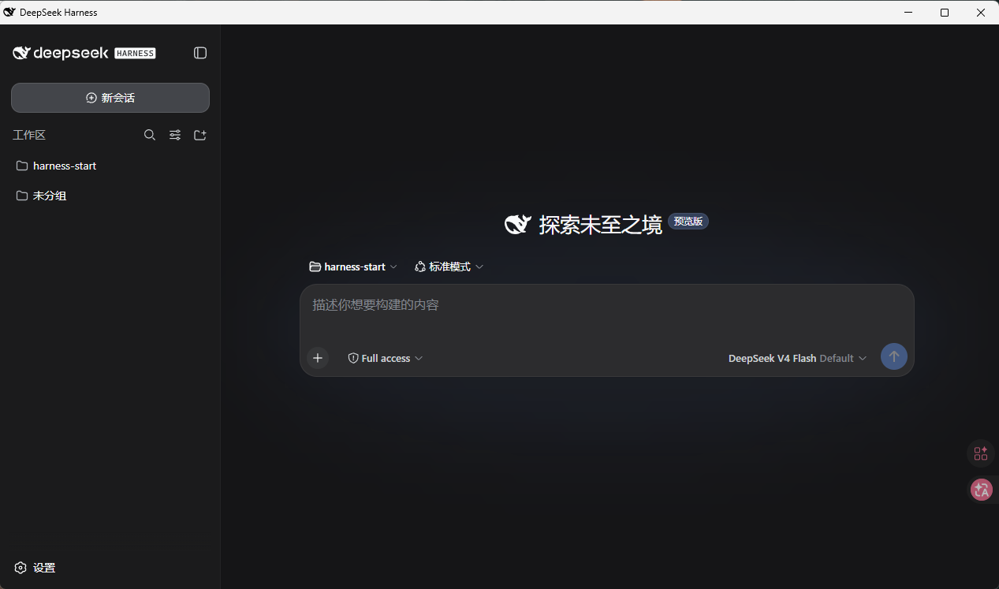

<h1 align="center">harness-start</h1>

<p align="center">
  
  
  
</p>

<p align="center">
  <a href="README.zh.md">简体中文</a> |
  <a href="README.zh-TW.md">繁體中文</a> |
  <a href="README.en.md">English</a> |
  <a href="README.ja.md">日本語</a> |
  <a href="README.ko.md">한국어</a> |
  <a href="README.fr.md">Français</a> |
  <a href="README.de.md">Deutsch</a> |
  <a href="README.es.md">Español</a>
</p>

<p align="center">
  
</p>

A **DeepSeek Harness desktop launcher** built on **webview**, cross-platform (Windows / macOS / Linux).

Double-click or a single command:

- **Auto-provisioned toolchain**: detects/installs `node → npm taobao mirror + nrm → dsh` level by level, refusing redundant installs;
- **Auto-start service**: registers `dsh web` as a system service that runs automatically at boot;
- **Desktop window**: opens DeepSeek Harness in the system's built-in Edge / Chrome in **app mode** (a standalone window without the address bar or bookmarks bar, resembling a desktop application).

## How it works

```
start launcher
   │ ① run setup (auto-fills missing toolchain)
   │ ② resolve port: --port arg > service config > DSH_PORT > default 3080
   │ ③ check if the dsh service is running; start it if not
   ▼
webview (Edge / Chrome --app) ──►  http://localhost:<port>
```

Internally the service runs as `node <dsh cli> web --port 3080 --host 127.0.0.1`, listening only on the local loopback address.

## Quick start

### Windows (recommended)

Double-click `start.cmd`, or from the command line:

```bat
start.cmd
```

Or use the PowerShell version:

```powershell
powershell -ExecutionPolicy Bypass -File start.ps1
```

### macOS / Linux

```bash
bash start.sh
```

The first run auto-fills any missing toolchain (requires network); subsequent runs open instantly.

> **Before the first launch, you need to install the dsh service** (just once; it auto-starts at boot):
>
> ```bat
> rem Windows (administrator privileges)
> server\install-server-service.cmd
> ```
>
> ```bash
> # macOS / Linux (sudo)
> sudo bash server/install-server-service.sh
> ```
>
> Or with PowerShell: `powershell -ExecutionPolicy Bypass -File server\install-server-service.ps1`.
>
> If the service is not installed yet, `start.cmd` / `start.ps1` / `start.sh` can only detect/attempt to start it and will warn that it is not installed; run the install above first.

## Script overview

The project has three groups of scripts; logic is consistent across platforms.

### 1. Launcher (entry) — `start.cmd` / `start.ps1` / `start.sh`

Use only this one for day-to-day use. It automatically: detects the toolchain (**skips setup if dsh is already ready**) → detects/starts the dsh service → opens the desktop window via webview.

| arg (cmd) | arg (ps1) | arg (sh) | Description |
| --- | --- | --- | --- |
| `--port <port>` | `-Port <port>` | `--port <port>` | Service port (default 3080) |
| `--debug` | `-Debug` | `--debug` | Run setup in debug mode (isolated install into the script dir) |
| `--help` | `-Help` | `--help` | Show help |
| `/nopause` | - | - | Compatible arg (no pause behavior anymore) |

```bash
# Windows
start.cmd --port 8080
# macOS / Linux
bash start.sh --port 8080
```

### 2. Toolchain install — `setup.cmd` / `setup.ps1` / `setup.sh`

**Does only one thing**: detects/installs `nvm → node → (npm taobao mirror + nrm) → dsh` level by level, skipping any level that is already ready, never reinstalling.

1. **nvm**: only detect/use (shell function / nvm-windows), **never install**;
2. **node**: check the major version is ≥22; if not, prefer installing Node 22 via nvm; if nvm is unavailable or fails, download the official build from `nodejs.org` into the target dir (default `nodejs/` under the script dir);
3. **npm taobao mirror + nrm**: set the npm registry to `https://registry.npmmirror.com` (skip if already set) and install `nrm` globally (a failure is only a warning, not fatal);
4. **dsh**: if missing, `npm install -g @deepseek-ai/dsh` (by then already using the taobao mirror).

| arg (sh) | arg (ps1) | arg (cmd) | Description |
| --- | --- | --- | --- |
| `--dir <path>` | `-Dir <path>` | `--dir <path>` | Node install dir (default: `nodejs/` under the script dir) |
| `--no-env` | `-NoEnv` | `--no-env` | Do not modify the PATH environment variable |
| `--dry-run` | `-DryRun` | `--dry-run` | Only detect, do not download/install |
| `--debug` | `-Debug` | `--debug` | Debug mode (see below) |
| `--help` | `-Help` | `--help` | Show help |
| - | - | `/nopause` | Compatible arg (no pause behavior anymore) |

```bash
bash setup.sh --dry-run        # only detect the current environment
bash setup.sh --dir /opt/node  # specify the install dir
bash setup.sh --debug          # isolated verification install
```

### 3. Service management — `server/` directory

Installs `dsh web` as a system service that **auto-starts at boot**. One main script `server-service.<ext>` per platform, plus four convenience wrappers: `install` / `start` / `stop` / `uninstall`.

| Platform | Service mechanism | Script |
| --- | --- | --- |
| Windows | Scheduled task `dsh-web` (`schtasks /sc onstart`, SYSTEM user, auto-start at boot) | `server-service.cmd` / `server-service.ps1` |
| Linux | systemd `dsh-web.service` | `server-service.sh` |
| macOS | launchd `com.deepseek-harness.dsh-web.plist` | `server-service.sh` |

Unified usage (`server-service.<ext>`):

| Command | Description |
| --- | --- |
| `install` | Register and start the service |
| `uninstall` | Uninstall the service |
| `start` / `stop` | Start / stop the service |
| `status` | Show service status |

The service runs as the SYSTEM / root account; its `homedir()` differs from the desktop user, so it cannot see sessions created by manual launches. Therefore the registration command explicitly sets `DSH_HOME=<user home>\.dsh` (the highest-priority data-root override supported by dsh), so the service and manual launches **share the same session data**.

The wrappers pass arguments through directly:

| arg | Description |
| --- | --- |
| `--port <port>` | Port (default 3080) |
| `--host <host>` | Bind address (default 127.0.0.1) |
| `--debug` | Use nodejs/dsh under the script dir |

For example:

```bat
server\install-server-service.cmd --port 8080
bash server/install-server-service.sh
```

> `install` / `uninstall` on Windows requires administrator privileges; Linux / macOS require root / sudo.

**Update dsh** — `update-dsh.<ext>`: updates `@deepseek-ai/dsh` to the latest version and, if the service is installed, restarts it to apply the change:

```bat
server\update-dsh.cmd            # update dsh and restart the service
server\update-dsh.cmd --dry-run  # only show current/latest version, no update
server\update-dsh.cmd --debug    # update dsh under the script-dir node
```

```bash
bash server/update-dsh.sh         # macOS / Linux, same args
```

## Port resolution

The launcher resolves the `dsh web` port in the following order of precedence:

1. `--port` / `-Port` command-line argument
2. the `--port` registered in the service config
3. environment variable `DSH_PORT`
4. default `3080`

## Debug mode (`--debug` / `-Debug`)

Used for **isolated verification** of the install, unaffected by the user's existing nvm/node environment:

1. removes only the path entries containing `nvm` / `node` from the **current session** PATH, not system environment variables;
2. forces the install dir to `nodejs/` under the script dir (already gitignored);
3. **skips nvm**, forces official download;
4. subsequent nrm/dsh follow the same logic as normal mode (`npm install -g`): PATH already points to the script-dir node, whose global prefix is naturally isolated; uses session-level `npm_config_registry` / `npm_config_prefix` to isolate the npm registry and global dir, **without writing the user's `~/.npmrc`**;
5. updates only the current session PATH, **does not write** the user's persistent PATH.

### Activating the current session (keeping the debug env)

When running `setup.cmd` / `setup.sh` / `setup.ps1` directly, the script's environment changes only apply within its own process (restored when the script exits). To switch the **current terminal session** into the debug environment (`node` pointing at the script-dir `nodejs/`, npm via the taobao mirror), use an activating call:

| shell | activating command | Description |
| --- | --- | --- |
| cmd | `call setup.cmd --debug` | `call` runs in the same cmd instance, env is kept |
| git-bash / bash | `source setup.sh --debug` | `source` runs in the current shell, env is kept |
| PowerShell | `.\setup.ps1 -Debug` | `$env:` changes are naturally kept; just run it |

After activation the current session switches to the debug environment (`node -v` shows the script-dir version), without writing the user's persistent PATH; new terminals are unaffected.

## i18n

Prompts/logs auto-load `locales/<lang>.lang` based on the system language — **8 languages**: `zh`, `zh-TW`, `en`, `ja`, `ko`, `fr`, `de`, `es`; defaults to Chinese if undetected or unknown.

Use the `SETUP_LANG` environment variable to force a language (highest priority), e.g. `SETUP_LANG=en start.cmd`.

## Version maintenance

The latest Node.js 22 LTS version is maintained centrally at the top of the scripts; upgrade only needs one change:

- `setup.sh`: `VERSION="v22.23.2"`
- `setup.ps1`: `$Script:Version = "22.23.2"` + `$Script:VVersion = "v22.23.2"`
- `setup.cmd`: `VERSION=v22.23.2` + `NVM_VERSION=22.23.2`

## License

MIT
